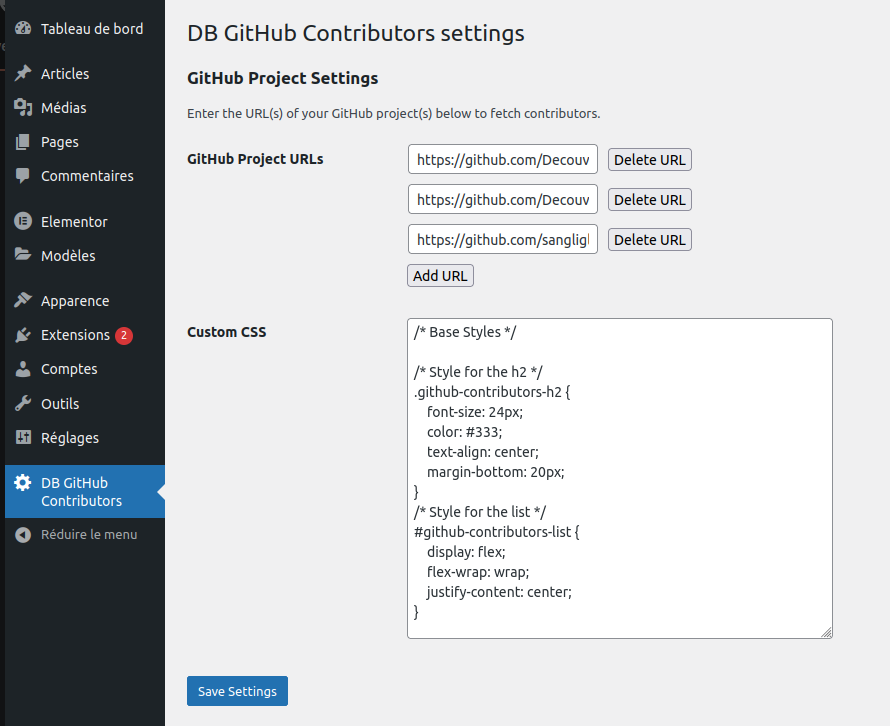
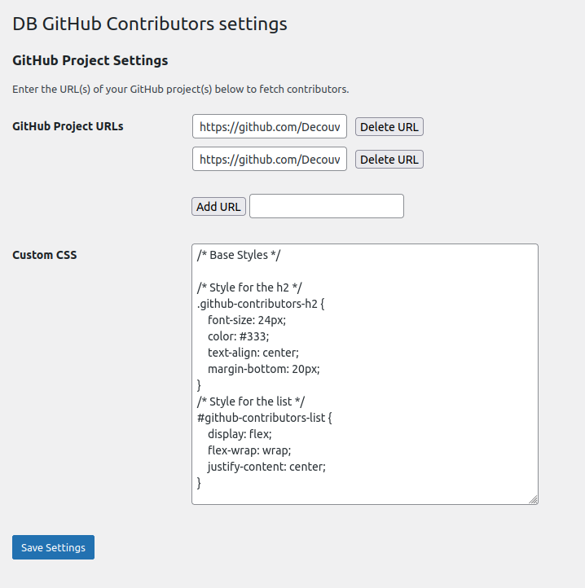

# DB-GitHub-Contributors

## Description

DB GitHub Contributors is a WordPress plugin designed to showcase GitHub profiles that have contributed to one or more specific projects. It offers a simple and effective way to display GitHub contributors on your WordPress site.

## Features

1. **Display contributors via shortcode:** Allows displaying GitHub contributors on a page or post using a shortcode.
2. **Configuration of settings via admin interface:** Provides a user-friendly interface in the WordPress admin area to configure the GitHub project URL and custom CSS.
3. **CSS customization:** Enables users to customize the appearance of GitHub contributors by adding their own CSS via the admin interface.
4. **Loading custom CSS:** Loads custom CSS on the WordPress site to apply the styles specified by the user.
5. **Contributor management:** Uses the GitHub API to retrieve contributor information and display it attractively on the WordPress site.
6. **Easy installation and usage:** The plugin is easy to install and use, allowing WordPress users to effectively showcase GitHub contributors in an aesthetic manner on their site.

By combining these features, the DB GitHub Contributors plugin offers a convenient solution for highlighting GitHub contributors on a WordPress site, which can be useful for open-source projects, technical blogs, and development-focused websites.

## Installation

1. Download the ZIP file from GitHub.
2. Go to "Plugins" > "Add New" in the WordPress dashboard.
3. Click on "Upload Plugin" and select the downloaded ZIP file.
4. Activate the plugin after installation.

## Configuration

1. Go to the "DB GitHub Contributors" section in the left menu of the admin interface.
2. Configure your GitHub project URL (You can add multiple projects) and customize the CSS if necessary.

## Using the shortcode

Use the following shortcode to display GitHub contributors on a page or post:

[github_contributors]

## Advanced customization

For advanced customization, you can add custom CSS in the plugin settings.

## Saving and publishing

Remember to save your settings after configuration and publish or update the pages or posts containing the shortcode.

## Screenshots

